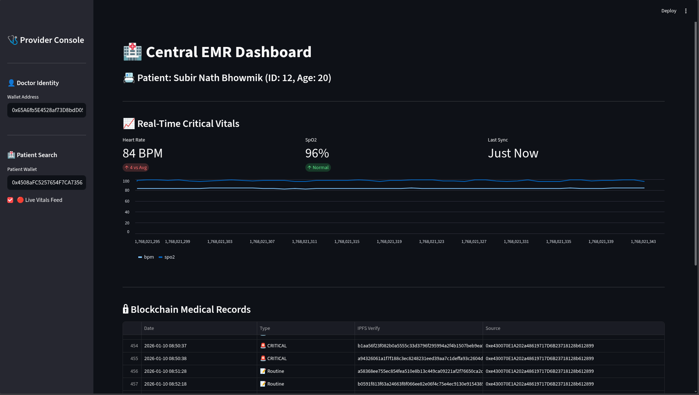
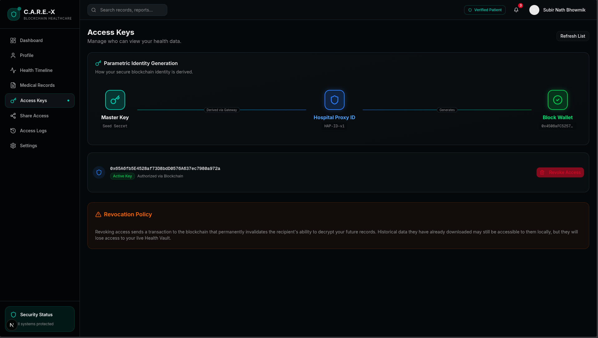
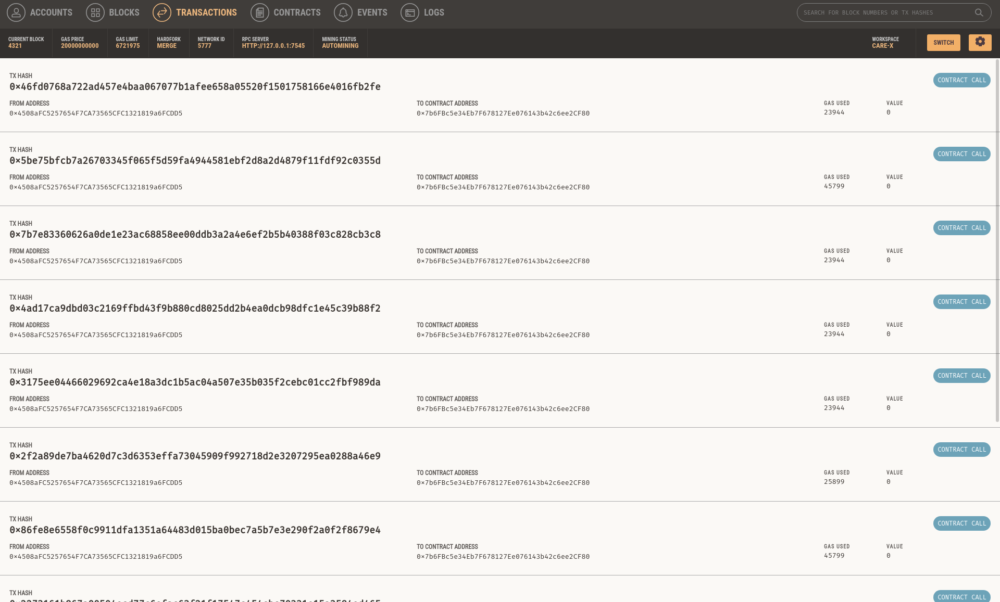

# Project C.A.R.E - X

**Decentralized Healthcare Trust Layer**

Project C.A.R.E - X is a blockchain-based healthcare system designed to facilitate secure, privacy-preserving sharing of medical data between hospitals, doctors, and patients. It integrates medical hardware, EMR systems, IPFS for distributed storage, and a public blockchain for trust and access control.

## 🏗 System Architecture

The system consists of several key components:

*   **Public Blockchain**: Anchors trust, manages access control (ACL), and logs consent/audit trails.
*   **EMR Platform**:
    *   **Backend**: FastAPI-based server handling logic and blockchain interaction.
    *   **Frontend**: Vite/React web interface for hospital staff.
*   **Doctor/Auditor Dashboard**: Streamlit application for clinicians and auditors to view unified data.
    
    
*   **Patient Dashboard**: Next.js application for patients to manage their records and consent.
*   **Hardware Gateway**: Python service simulating medical hardware data ingestion.
*   **IPFS**: Used for distributed storage of large medical files (simulated or actual integration).

## 🚀 Getting Started

### Prerequisites

Ensure you have the following installed:

*   **Node.js** (v18+ recommended) & **npm**
*   **Python 3.8+** & **pip**
*   **Ganache**: For running a local Ethereum blockchain.

### 1. Environment Configuration

The project uses a centralized `.env` file for configuration.

1.  Copy the example environment file:
    ```bash
    cp .env.example .env
    ```
2.  Open `.env` and verify the configurations.
    *   **Ganache**: Ensure `NEXT_PUBLIC_BLOCKCHAIN_URL` matches your local Ganache RPC URL (usually `http://127.0.0.1:7545`).
    *   **Accounts**: The `.env.example` comes pre-filled with deterministically generated Ganache accounts (from the mnemonic provided in project docs if applicable). If you use a fresh Ganache workspace, you may need to update these addresses and keys.
        
        

### 2. Install Dependencies

You need to install dependencies for the various sub-components.

**Blockchain & Backend:**
```bash
pip install -r blockchain/requirements.txt
pip install -r emr_platform/backend/requirements.txt
pip install streamlit # For the Dashboard
```

**EMR Frontend:**
```bash
cd emr_platform/frontend
npm install
cd ../..
```

**Patient Dashboard:**
```bash
cd patient-dashboard-app
npm install
cd ..
```

### 3. Blockchain Setup

1.  Start your **Ganache** workspace.
    
    
2.  Ensure it is running on the port specified in `.env` (default `7545`).
3.  Deploy the Smart Contracts:
    ```bash
    cd blockchain
    python3 deploy_contract.py
    cd ..
    ```
    *Note: The `.env` file might already contain a pre-deployed contract address suitable for the provided Ganache accounts.*

## 🏃 Connectivity & Usage

### Option A: Quick Start (Hospital System)

Use the provided shell script to spin up the Hospital EMR, Backend, Gateway, and Doctor Dashboard.

```bash
./run.sh
```

This script will launch:
*   **EMR Backend**: Types (`http://localhost:8000`)
*   **EMR Frontend**: (`http://localhost:5173`)
*   **Doctor Dashboard**: (`http://localhost:8501`)
*   **Hardware Gateway**: (Background service)
*   It will also seed the database with mock data.

### Option B: Running Components Individually

**1. EMR Backend:**
```bash
cd emr_platform/backend
uvicorn main:app --reload --port 8000
```
*Wait for the backend to start before running frontends.*

**2. EMR Frontend (Hospital Portal):**
```bash
cd emr_platform/frontend
npm run dev
```

**3. Doctor's Dashboard:**
```bash
streamlit run dashboard/app.py
```

**4. Hardware Gateway:**
```bash
python3 gateway/service.py
```

### Running the Patient Dashboard

The Patient Dashboard is a separate Next.js application.

```bash
cd patient-dashboard-app
npm run dev
```
Access it at user specific port (usually `http://localhost:3000`).

## 🔑 Key Features

*   **Decentralized Identity**: Patients control their identity and record access.
*   **Consent Management**: Grant/Revoke access to specific doctors or hospitals via Blockchain.
*   **Immutable Logs**: All access and data sharing events are recorded on-chain.
*   **Interoperability**: Designed to bridge gaps between different EMR systems (e.g., Epic, Cerner simulation).

## 📂 Directory Structure

*   `blockchain/`: Smart contracts (Solidity) and deployment scripts.
*   `emr_platform/`: The core Hospital Information System (Backend + Frontend).
*   `patient-dashboard-app/`: API and UI for the Patient Portal.
*   `dashboard/`: Analytics and unified view for Doctors.
*   `gateway/`: IoT/Hardware simulation layer.
*   `hardware/`: Hardware specific configurations/code.
